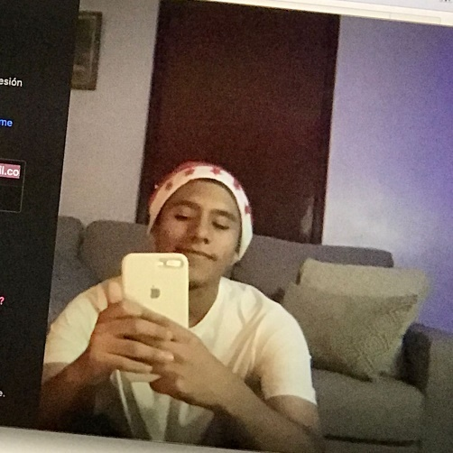

# Índice

- [CAPITULO I: INTRODUCCIÓN](#capitulo-i-introducción)
    - [Startup Profile](#startup-profile)
        - [Descripción de la Startup](#descripción-de-la-startup)
        - [Perfiles de integrantes del equipo](#perfiles-de-integrantes-del-equipo)
    - [Solution Profile](#solution-profile)
        - [Antecedentes y Problemática](#antecedentes-y-problemática)
        - [Lean UX Process](#lean-ux-process)
            - [Lean UX Problem Statements](#lean-ux-problem-statements)
            - [Lean UX Assumptions](#lean-ux-assumptions)
            - [Lean UX Hypothesis Statements](#lean-ux-hypothesis-statements)
    - [Segmentos Objetivo](#segmentos-objetivo)

# CAPITULO I: INTRODUCCIÓN

## 1.1. Startup Profile

### 1.1.1. Descripción de la Startup

**“The Big Fun”** surgió para facilitar la búsqueda de eventos sociales. Muchos jóvenes suelen buscar un lugar donde divertirse los fines de semana. Existen algunas discotecas, por ejemplo, que venden entradas por redes sociales como Facebook o Instagram, y el proceso de compra de las entradas suele ser tedioso a la hora de esperar a que alguna persona conteste los mensajes y realice la atención. Otra problemática nace cuando llega el fin de semana y tu grupo de amigos no sabe a dónde salir; las personas podrán buscar los eventos por las redes, pero es otro procedimiento que puede llevar mucho tiempo.

Para resolver estas problemáticas, crearemos una aplicación en donde el Attendee (asistente) podrá visualizar los eventos disponibles, así como la información sobre la temática, la dirección, la cantidad de personas que van a asistir, precios, entre otros. Además, los Organizer (organizadores de eventos) podrán vender sus entradas y generar códigos QR mediante la aplicación. De esta manera, agilizamos más el proceso de compra y venta de las entradas y el proceso de búsqueda de los eventos sociales.

**Misión:** Nuestra misión es facilitar a las personas la búsqueda de eventos sociales y la compra y venta de entradas. Asimismo, ayudar a los Organizer a tener un evento rentable.

**Visión:** Ser una aplicación y empresa con reconocimiento nacional e internacional en la publicidad de eventos y en el mercado de las transacciones de entradas.

### 1.1.2. Perfiles de integrantes del equipo

<table>
  <tr>
    <td></td>
    <td>
      
<strong>Alumno: Ayasta Leonardo, Valery Ruth</strong>

      
<strong>Código:</strong> U20211C231

      
<strong>Carrera:</strong> Ingeniería de Software

      
Tengo 19 años y me encuentro en 7mo ciclo. Para este proyecto puedo apoyar con mi responsabilidad y mis conocimientos de desarrollo web y móvil, tanto en front-end y backend.

    </td>
  </tr>
  <tr>
    <td></td>
    <td>
      
<strong>Alumno: Fabricio Raúl Huillca Mateos</strong>

      
<strong>Código:</strong> U202118067

      
<strong>Carrera:</strong> Ingeniería de Software

      
Soy estudiante de Ingeniería de Software en la UPC. Desde mi niñez, he demostrado un marcado interés por la tecnología. Mi estilo de vida se caracteriza por la serenidad y la determinación. A lo largo de mi experiencia universitaria, he fortalecido y adquirido una variedad de habilidades que estoy seguro contribuirán de manera exitosa a este proyecto.

    </td>
  </tr>
  <tr>
    <td></td>
    <td>
      
<strong>Alumno: William Martín Riega Ocharan</strong>

      
<strong>Código:</strong> U202112272

      
<strong>Carrera:</strong> Ingeniería de Software

      
Mi nombre es William Martin Riega Ocharan, estudiante de Ingeniería de Software de 7mo ciclo. Me considero una persona apasionada con lo que hace y comprometida. Mis fortalezas son el desarrollo backend .NET, modelos de base de datos relacional y desarrollo mobile en Flutter. Fuera de la tecnología soy un aficionado del cine y la escritura de novelas distópicas o dramáticas.

    </td>
  </tr>
  <tr>
    <td></td>
    <td>
      
<strong>Alumno: Rodrigo Jair Pozo Campos</strong>

      
<strong>Código:</strong> U20181E187

      
<strong>Carrera:</strong> Ingeniería de Software

      
Mi nombre es Rodrigo Pozo Campos soy estudiante de ingeniería de Software. Soy una persona responsable y que trata de mantener todo los entregables en orden. Tengo conocimientos en distintos frameworks tanto para el frontend como para el backend. Creo que puedo ser de gran ayuda para nuestro grupo y de esta manera poder realizar un buen producto.

    </td>
  </tr>
  <tr>
    <td></td>
    <td>
      
<strong>Alumna: Isabella María Soriano Huapaya</strong>

      
<strong>Código:</strong> U20211c242

      
<strong>Carrera:</strong> Ingeniería de Software

      
Soy una estudiante de la carrera de ingeniería de software, cursando mi quinto ciclo de carrera. Mi experiencia con los negocios la tengo gracias a cursos de administración empresarial, los cuales me sirvieron para saber identificar un problema y solucionarlo mediante la creación de un proyecto de emprendimiento. En suma, aquellos cursos propios de mi carrera; me dieron la capacidad de llevar a cabo la idea de negocio a una aplicación que se desempeñará como servicio. Las habilidades que poseo y pondré a disposición en el equipo son capacidad de retención y análisis de información, liderazgo y organización.

    </td>
  </tr>
</table>

## 1.2. Solution Profile

**“The Big Fun”** es una aplicación diseñada para facilitar la búsqueda y compra de entradas para eventos sociales en Perú. Nuestra aplicación permite a los usuarios visualizar la información necesaria como la temática, la dirección, la cantidad de personas que van a asistir y los precios. Además, los Organizer podrán vender sus entradas y generar códigos QR mediante la aplicación, lo que simplificará el proceso de compra y venta de entradas. Además de esto, los asistentes recibirán una pulsera la cual servirá como identificador de las personas además de poder darnos su ubicación a través de ella.

### 1.2.1. Antecedentes y Problemática

- **What (¿Qué?):** ¿Qué problema enfrenta la gestión de eventos? La gestión de eventos enfrenta dificultades para proporcionar una experiencia de usuario intuitiva y eficiente.
- **Why (¿Por qué?):** ¿Por qué es importante resolver este problema? Es importante resolver este problema porque una experiencia de usuario deficiente puede llevar a la insatisfacción de los usuarios, pérdida de clientes y una mala reputación para el organizador.
- **Who (¿Quién?):** ¿Quiénes están siendo afectados por este problema? Los organizadores de eventos, los asistentes y los proveedores de servicios relacionados con eventos están siendo afectados por este problema.
- **When (¿Cuándo?):** ¿Cuándo ocurre este problema con mayor frecuencia? Este problema ocurre durante todo el ciclo de vida del evento, desde la planificación hasta la ejecución del evento.
- **Where (¿Dónde?):** ¿Dónde se manifiesta principalmente este problema? Este problema se manifiesta en la gestión de eventos y en la comunicación entre los diferentes usuarios.
- **How (¿Cómo?):** ¿Cómo se está abordando actualmente este problema? Actualmente, el problema se está abordando mediante la optimización de las funciones de gestión de eventos y la recopilación de comentarios de los usuarios.
- **How Much (¿Cuánto?):** ¿Cuánto impacta este problema en la satisfacción del usuario? Este problema tiene un impacto significativo en la satisfacción del asistente, lo que potencialmente puede resultar en la pérdida de clientes y oportunidades comerciales.

### 1.2.2. Lean UX Process

#### Lean UX Problem Statements

En la organización de eventos, ya sea conferencias, conciertos, fiestas o cualquier otro tipo de evento, surge la necesidad de una gestión eficiente y efectiva. Los organizadores se enfrentan a numerosos desafíos desde la planificación y coordinación de tareas.

La gestión manual de eventos conlleva una serie de problemas como la falta de sincronización en la planificación, dificultades en la asignación de tareas, errores en la comunicación y seguimiento ineficiente del progreso. Esto puede resultar en retrasos, confusiones, costos adicionales y, en última instancia, una experiencia insatisfactoria para los asistentes.

**¿Cómo podemos simplificar y optimizar el proceso de gestión de eventos para garantizar una experiencia exitosa tanto para los organizadores como para los asistentes?**

#### Lean UX Assumptions

1. Los usuarios muestran una clara preferencia por una experiencia de compra de entradas que sea rápida y eficiente, evitando la incomodidad de esperas y filas en los puntos de venta físicos.
2. Los usuarios expresan un deseo por la comodidad de adquirir sus boletos en línea desde la comodidad de sus dispositivos móviles o computadoras.
3. Los usuarios tienen un interés marcado en acceder a detalles de los eventos sociales como ubicación, precio, temática y cantidad de asistentes previstos, lo que les permitirá tomar decisiones informadas acerca de qué eventos asistir.
4. Los organizadores de eventos sociales desean una plataforma sencilla y eficaz que les facilite la venta de entradas, la promoción y gestión de sus eventos.
5. Los usuarios tienen una expectativa de seguridad y confiabilidad al realizar transacciones de compra de entradas dentro de la aplicación.

#### Lean UX Hypothesis Statements

- **Hipótesis 1:** Creemos que si creamos una plataforma intuitiva y fácil de usar para buscar y comprar entradas para eventos, aumentaremos la satisfacción de los usuarios finales y su frecuencia de asistencia a eventos. Sabremos que tuvimos éxito cuando observemos un aumento del 20% en la frecuencia de asistencia a eventos por usuario.

- **Hipótesis 2:** Creemos que si proporcionamos herramientas de promoción, aumentaremos la visibilidad de sus eventos y les permitiremos llegar a un público más amplio. Sabremos que tuvimos éxito cuando veamos un aumento del 30% en la cantidad de eventos promocionados y una mejora del 25% en la asistencia a los eventos anunciados.

- **Hipótesis 3:** Creemos que si implementamos un sistema de gestión de entradas y escaneo de códigos QR en la puerta del evento, mejoraremos la experiencia de los asistentes al agilizar el proceso de entrada y brindar mayor seguridad y control. Sabremos que tuvimos éxito cuando la velocidad de entrada al evento aumente en un 50% y haya una reducción del 30% en los problemas relacionados con la entrada.

#### Lean UX Canvas

[[Enlace 1]](#_ANEXOS)

## 1.3. Segmentos Objetivo

- **“Attendee”**
    - Jóvenes de 18 a 25 años que buscan eventos sociales en su ciudad y desean una experiencia de compra de entradas en línea rápida y segura.
    - Adultos jóvenes de 25 a 35 años que buscan eventos más exclusivos y sofisticados como cenas y fiestas en clubes de alta gama.
    - Grupos de amigos que desean planificar su fin de semana y buscan información detallada sobre eventos sociales cercanos como la temática, la ubicación y el precio.
    - Personas que viajan y desean encontrar eventos sociales en la ciudad que están visitando.

- **“Organizer”**
    - Organizadores de eventos sociales que buscan una plataforma en línea para vender sus entradas y promocionar sus eventos.
    - Empresas que desean organizar eventos sociales para sus empleados o clientes y buscan una manera fácil de comprar entradas en línea para ellos.
    - Estudiantes universitarios que buscan eventos gratuitos o con descuentos para ahorrar dinero.
    - Personas solteras que buscan eventos sociales como fiestas y cenas para conocer a otras personas.
    - Viajeros de negocios que buscan eventos sociales para conocer a otras personas y expandir su red de contactos.
