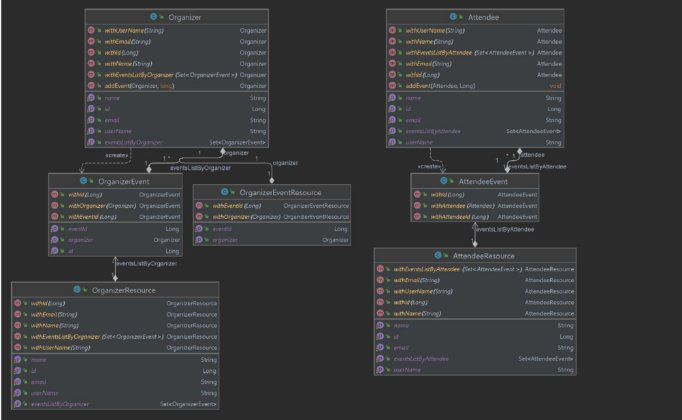
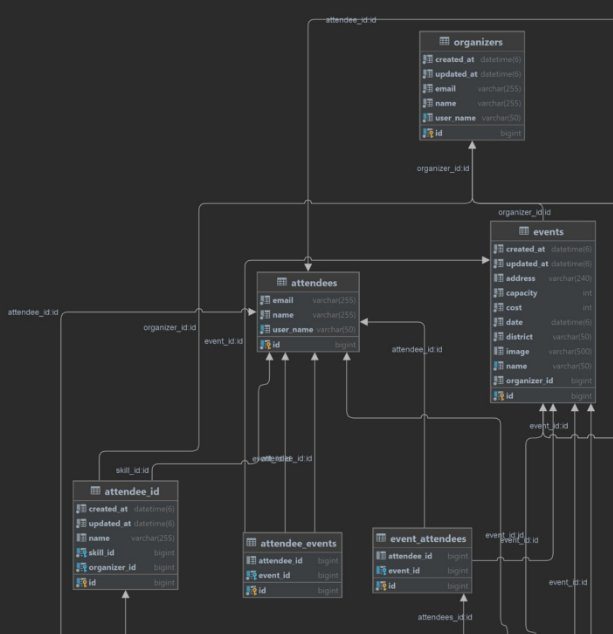

### Índice
- [4.2. Tactical-Level Domain-Driven Design](https://github.com/CrackeletsGroup-IoT/upc-pre-202401-si572-sw71-CrackeletsGroup-report-tf/blob/capitulo4/capitulo4/CAPITULO%20IV.md#42-tactical-level-domain-driven-design)
  - [4.2.2. Bounded Context: Profile](#422-bounded-context---profile)
    - [4.2.2.1. Domain Layer](#4221-domain-layer)
    - [4.2.2.2. Interface Layer](#4222-interface-layer)
    - [4.2.2.3. Application Layer](#4223-application-layer)
    - [4.2.2.4. Infrastructure Layer](#4224-infrastructure-layer)
    - [4.2.2.5. Bounded Context Software Architecture Component Level Diagrams](#4225-bounded-context-software-architecture-component-level-diagrams)
    - [4.2.2.6. Bounded Context Software Architecture Code Level Diagrams](#4226-bounded-context-software-architecture-code-level-diagrams)
      - [4.2.2.6.1. Bounded Context Domain Layer Class Diagrams](#42261-bounded-context-domain-layer-class-diagrams)
      - [4.2.2.6.2. Bounded Context Database Design Diagram](#42262-bounded-context-database-design-diagram)

### 4.2.2. Bounded Context :  Profile  

En este bounded context se maneja la representación y gestión de un perfil de usuario, así como su creación y métodos para interactuar con ellos.

#### 4.2.2.1. Domain Layer

En la capa Domain se representa y modela el núcleo del negocio, en este caso del contexto de Profile: los usuarios, Attendee y Organizer, son modelados en dos clases distintas.

**Aggregate 1**

| **Nombre** | **Categoría**    | **Propósito**                                                                 |
|:-----------|:-----------------|:------------------------------------------------------------------------------|
| Attendee   | Entity/Aggregate | Representación de los usuarios que desean ser parte de un evento y sus datos. |

*Atributos*

|     **Nombre**      |**Tipo de dato**|**Visibilidad**|**Descripción**|
|:-------------------:| :- | :- | :- |
|         id          |Long|Private|Identificador único|
|      userName       |String|Private|Nombre de usuario |
|        name         |String|Private|Nombre completo|
|        email        |String|Private|Correo electrónico|
| eventListByAttendee |Set|Private|Lista de eventos que atiende|

*Métodos*

|     **Nombre**      | **Tipo de retorno** | **Visibilidad** | **Descripción**                |
|:-------------------:|:--------------------|:----------------|:-------------------------------|
|     Constructor     | Void                | Public          | Constructor para Attendee      |
|      addEvent       | Void                | Public          | Añadir al attendee a un evento |

**Aggregate 2**

|      **Nombre**      | **Categoría**       | **Propósito**                                                  |
|:--------------------:|:--------------------|:---------------------------------------------------------------|
|      Organizer       | Entity/Aggregate    | Representación de los organizadores que desean crear un evento |

*Atributos*

|      **Nombre**      | **Tipo de dato** | **Visibilidad** | **Descripción**                           |
|:--------------------:|:-----------------|:----------------|:------------------------------------------|
|          id          | Long             | Private         | Identificador único                       |
|       userName       | String           | Private         | Nombre de usuario                         |
|         name         | String           | Private         | Nombre completo                           |
|        email         | String           | Private         | Correo electrónico                        |
| eventListByOrganizer | Set              | Private         | Lista de eventos que tiene un organizador |

*Métodos*    

| **Nombre**  | **Tipo de retorno** | **Visibilidad** | **Descripción**                             |
|:-----------:|:--------------------|:----------------|:--------------------------------------------|
| Constructor | Void                | Public          | Constructor para Attendee                   |
|  addEvent   | Void                | Public          | Añadir un evento creador por el organizador |

#### 4.2.2.2. Interface Layer

**Controller 1**

|     **Nombre**     | **Categoría**       | **Propósito**                |
|:------------------:|:--------------------|:-----------------------------|
| AttendeeController | Controller          | Controlador para un Attendee |

*Atributos*
   
|   **Nombre**    | **Tipo de dato**    | **Visibilidad** | **Descripción**                 |
|:---------------:|:--------------------|:----------------|:--------------------------------|
| attendeeService | AttendeeService     | Private         | Servicio para Attendee          |
|     mapper      | AttendeeMapper      | Private         | Mapper para Attendee            |

*Métodos*

|   **Nombre**    | **Tipo de retorno** | **Visibilidad** | **Descripción**                 |
|:---------------:|:--------------------|:----------------|:--------------------------------|
|   Constructor   | Void                | Public          | Constructor del controlador     |
| createAttendee  | ResponseEntity      | Public          | Crear un Attendee               |
| getAttendeeById | AttendeeResource    | Public          | Buscar Atendee según Id         |
| getAllAttendee  | Page                | Public          | Obtener todos los Attendee      |
|    getByName    | AttendeeResource    | Public          | Buscar Attendee según nombre    |
| updateAttendee  | AttendeeResource    | Public          | Actualizar datos de un Attendee |
| deleteAttendee  | ResponseEntity      | Public          | Eliminar un Attendee            |

**Controller 2**

|     **Nombre**      | **Categoría** | **Propósito**                 |
|:-------------------:|:--------------|:------------------------------|
| OrganizerController | Controller    | Controlador para un Organizer |

*Atributos*

|    **Nombre**    | **Tipo de dato**    | **Visibilidad** | **Descripción**         |
|:----------------:|:--------------------|:----------------|:------------------------|
| OrganizerService | OrganizerService    | Private         | Servicio para Organizer |
|      mapper      | OrganizerMapper     | Private         | Mapper para Organizer   |

*Métodos*

|    **Nombre**    | **Tipo de retorno** | **Visibilidad** | **Descripción**                  |
|:----------------:|:--------------------|:----------------|:---------------------------------|
|   Constructor    | Void                | Public          | Constructor del controlador      |
| createOrganizer  | ResponseEntity      | Public          | Crear un Organizer               |
| getOrganizerById | OrganizerResource   | Public          | Buscar Organizer según Id        |
| getAllOrganizer  | Page                | Public          | Obtener todos los Organizer      |
|    getByName     | OrganizerResource   | Public          | Buscar Organizer según nombre    |
| updateOrganizer  | OrganizerResource   | Public          | Actualizar datos de un Organizer |
| deleteOrganizer  | OrganizerEntity     | Public          | Eliminar un Organizer            |

#### 4.2.2.3. Application Layer

En el contexto de perfiles, el application layer sirve de intermediario entre los controladores y los modelos de dominio. Establece las reglas de negocio en métodos como la creación, actualización y eliminación de un perfil. En esta capa se encuentras los servicios de Attendee y Organizer.

**Service 1**

|   **Nombre**    | **Categoría** | **Propósito**                               |
|:---------------:|:--------------|:--------------------------------------------|
| AttendeeService | Service       | Servicio con reglas de negocio del Attendee |

*Atributos*

|     **Nombre**     | **Tipo de dato**   | **Visibilidad** | **Descripción**         |
|:------------------:|:-------------------|:----------------|:------------------------|
| attendeeRepository | AttendeeRepository | Private         | Repositorio de Attendee |
|     validator      | Validator          | Private         | Validador de atributos  |

*Métodos*

|     **Nombre**     | **Tipo de retorno** | **Visibilidad** | **Descripción**                               |
|:------------------:|:--------------------|:----------------|:----------------------------------------------|
|       getAll       | Page/List           | Public          | Obtener todos los Attendee en List o Pageable |
|      getById       | Attendee            | Public          | Obtener un Attendee según su Id               |
|     getByName      | Attendee            | Public          | Obtener un Attendee según su Nombre           |
|       create       | Attendee            | Public          | Crear un Attendee                             |
|       update       | Attendee            | Public          | Actualizar datos de un Attendee               |
|       delete       | ResponseEntity      | Public          | Eliminar un Attendee                          |
| addEventToAttendee | Attendee            | Public          | Agregar evento a Attendee                     |

**Service 2**

|     **Nombre**      | **Categoría** | **Propósito**                                |    
|:-------------------:|:--------------|:---------------------------------------------|
|  OrganizerService   | Service       | Servicio con reglas de negocio del Organizer |

*Atributos*

|     **Nombre**      | **Tipo de dato**    | **Visibilidad** | **Descripción**          |
|:-------------------:|:--------------------|:----------------|:-------------------------|
| OrganizerRepository | OrganizerRepository | Private         | Repositorio de Organizer |
|      validator      | Validator           | Private         | Validador de atributos   |

*Métodos*

|     **Nombre**      | **Tipo de retorno** | **Visibilidad** | **Descripción**                                |
|:-------------------:|:--------------------|:----------------|:-----------------------------------------------|
|       getAll        | Page/List           | Public          | Obtener todos los Organizer en List o Pageable |
|       getById       | Organizer           | Public          | Obtener un Organizer según su Id               |
|      getByName      | Organizer           | Public          | Obtener un Organizer según su Nombre           |
|       create        | Organizer           | Public          | Crear un Organizer                             |
|       update        | Organizer           | Public          | Actualizar datos de un Organizer               |
|       delete        | ResponseEntity      | Public          | Eliminar un Organizer                          |
| addEventToOrganizer | Organizer           | Public          | Añadir evento al Organizer                     |
|  addPayToOrganizer  | Organizer           | Public          | Añadir pago al Organizer                       |

#### 4.2.2.4. Infrastructure Layer

En la Infrastructure Layer se maneja la persistencia de datos; en el caso del bounded context de profile se observan los repositorios de Attendee y Organizer.

**Repository 1**

|     **Nombre**     | **Categoría** | **Propósito**                                      |
|:------------------:|:--------------|:---------------------------------------------------|
| AttendeeRepository | Repository    | Repositorio que guarda la información del Attendee |

*Métodos*

|   **Nombre**    | **Tipo de retorno** | **Visibilidad** | **Descripción**                                           |
|:---------------:|:--------------------|:----------------|:----------------------------------------------------------|
| findFirstByName | Attendee            | Public          | Devolver la primera coincidencia de Attendee según Nombre |
| findByUserName  | Attendee            | Public          | Buscar Attendee según nombre de usuario                   |
|   findByEmail   | Attendee            | Public          | Buscar Attendee según email                               |

**Repository 2**

|     **Nombre**      | **Categoría** | **Propósito**                                       |
|:-------------------:|:--------------|:----------------------------------------------------|
| OrganizerRepository | Repository    | Repositorio que guarda la información del Organizer |

*Métodos*

|   **Nombre**    | **Tipo de retorno** | **Visibilidad** | **Descripción**                                            |
|:---------------:|:--------------------|:----------------|:-----------------------------------------------------------|
| findFirstByName | Organizer           | Public          | Devolver la primera coincidencia de Organizer según Nombre |
| findByUserName  | Organizer           | Public          | Buscar Organizer según nombre de usuario                   |
|   findByEmail   | Organizer           | Public          | Buscar Organizer según email                               |

#### 4.2.2.5. Bounded Context Software Architecture Component Level Diagrams

#### 4.2.2.6. Bounded Context Software Architecture Code Level Diagrams

##### 4.2.2.6.1. Bounded Context Domain Layer Class Diagrams

##### 4.2.2.6.2. Bounded Context Database Design Diagram

