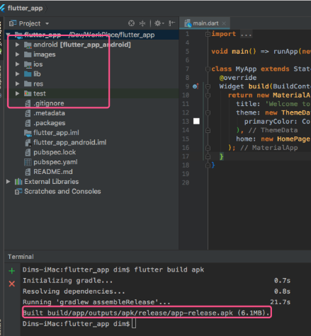

### Índice
- [6.2.3. Sprint 3](#623-sprint-3)
  - [6.2.3.1. Sprint Planning 3](#6231-sprint-planning-3)
  - [6.2.3.2. Sprint Backlog 3](#6232-sprint-backlog-3)
  - [6.2.3.3. Development Evidence for Sprint Review](#6233-development-evidence-for-sprint-review)
  - [6.2.3.4. Testing Suite Evidence for Sprint Review](#6234-testing-suite-evidence-for-sprint-review)
  - [6.2.3.5. Execution Evidence for Sprint Review](#6235-execution-evidence-for-sprint-review)
  - [6.2.3.6. Services Documentation Evidence for Sprint Review](#6236-services-documentation-evidence-for-sprint-review)
  - [6.2.3.7. Software Deployment Evidence for Sprint Review](#6237-software-deployment-evidence-for-sprint-review)
  - [6.2.3.8. Team Collaboration Insights during Sprint](#6238-team-collaboration-insights-during-sprint)

### 6.2.3. Sprint 3

Este sprint se centró en las mejoras finales del proyecto en todas las aplicaciones y completar las User Stories del Product Backlog.

#### 6.2.3.1. Sprint Planning 3

|Sprint#|Sprint 3|
| :- | :- |
|Sprint Planning Background||
|Date|2024-06-15|
|Time|03:00 PM|
|Location|Google Meet|
|Prepared By|Isabella Soriano|
|Attendees|Fabricio, Valery, Isabella, William, Rodrigo|
|Sprint 2 Review|Se desplegaron las aplicaciones web frontend y backend y se realizó el avance de la aplicación móvil y el prototipo IoT para conectarse al backend.|
|Sprint 2 Retrospective|Aún nos queda pendiente terminar la aplicación móvil y mejorar aspectos del prototipo IoT. |
|Sprint Goal & User Stories||
|Sprint 3 Goal|Realizar últimos detalles del funcionamiento de la solución IoT y la aplicación móvil. Asimismo, se debe tener la versión oficial de master del backend. Por último, se debe actualizar el Landing Page con los videos About The Product y About The Team.|
|Sprint 3 Velocity|21|
|Sum of Story Points|21|

#### 6.2.3.2. Sprint Backlog 3

<table><tr><th valign="top"><b>Sprint #</b></th><th colspan="7" valign="top"><b>Sprint 3</b></th></tr>
<tr><td colspan="2" valign="top"><b>User Story</b></td><td colspan="6" valign="top">Work-item / Task</td></tr>
<tr><td valign="top"><b>Id</b></td><td valign="top">Title</td><td valign="top">Id</td><td valign="top">Title</td><td valign="top">Description</td><td valign="top">Estimation (Hours)</td><td valign="top">Assigned To</td><td valign="top">Status(To-do / In-Process / To-Review / Done)</td></tr>
<tr><td valign="top"><b>US19</b></td><td valign="top">Reconocer a los que asisten al evento</td><td valign="top">TK01</td><td valign="top">Observar la lista de asistentes a un evento</td><td valign="top">Implementar en la aplicación móvil una vista para observar los asistentes que ya han llegado y los que faltan por llegar</td><td valign="top">6 hours</td><td valign="top">William</td><td valign="top">Done</td></tr>
<tr><td rowspan="2" valign="top"><b>US21</b></td><td rowspan="2" valign="top">Un asistente ubica a otros</td><td valign="top">TK02</td><td valign="top">Mostrar la distancia con otro attendee</td><td valign="top">Implementar la vista que permita observar la distancia que hay entre dos attendees</td><td valign="top">6 horas</td><td valign="top">William</td><td valign="top">Done</td></tr>
<tr><td valign="top">TK03</td><td valign="top">Subir la distancia entre dos attendees al backend</td><td valign="top">Implementar los métodos que permitan subir al backend la distancia entre dos personas.</td><td valign="top">5 horas</td><td valign="top">Rodrigo</td><td valign="top">Done</td></tr>
<tr><td rowspan="2" valign="top"><b>US20</b></td><td rowspan="2" valign="top">Atención en casos de emergencia</td><td valign="top">TK04</td><td valign="top">Mostrar etiquetas cuando el pulso de un attendee es anormal</td><td valign="top">En la app móvil, un organizer debe observar los signos vitales de sus attendees y recibir una alerta cuando exista una situación de peligro</td><td valign="top">6 horas</td><td valign="top">William</td><td valign="top">Done</td></tr>
<tr><td valign="top">TK05</td><td valign="top">Mostrar indicadores de la condición del pulso de un attendee</td><td valign="top">En el prototipo IoT, se debe mostrar un indicador (luces led) si los signos vitales del attendee son normales o anormales</td><td valign="top">5 horas</td><td valign="top">Rodrigo</td><td valign="top">Done</td></tr>
<tr><td valign="top"><b>-</b></td><td valign="top">-</td><td valign="top">TK06</td><td valign="top">Desplegar versión oficial del backend</td><td valign="top">Desplegar la rama master del backend</td><td valign="top">1 hora</td><td valign="top">Valery</td><td valign="top">Done</td></tr>
<tr><td valign="top"><b>-</b></td><td valign="top">-</td><td valign="top">TK07</td><td valign="top">Agregar videos al Landing Page</td><td valign="top">Incrustar los videos About-the-Team y About-the-Product en el Landing Page.</td><td valign="top">1 hora</td><td valign="top">Valery</td><td valign="top">Done</td></tr>
<tr><td valign="top"><b>-</b></td><td valign="top">-</td><td valign="top">TK08</td><td valign="top">Documentar .md</td><td valign="top">Pasar el report a .md</td><td valign="top">8 horas</td><td valign="top">Valery</td><td valign="top">Done</td></tr>
<tr><td valign="top"></td><td valign="top"></td><td valign="top">TK09</td><td valign="top">Documentar las entrevistas de validación</td><td valign="top">Registrar un resumen de las entrevistas</td><td valign="top">3 horas</td><td valign="top">Isabella</td><td valign="top">Done</td></tr>
</table>

#### 6.2.3.3. Development Evidence for Sprint Review

En esta sección mostramos los commits realizados en los repositorios de nuestro proyecto.

Para empezar, se hizo merge en la rama master del repositorio de nuestra API y desplegarlo con ayuda de Zeabur:

|Repository|Branch|Commit Id|Commit|Commited|
| :- | :- | :- | :- | :- |
|CrackeletsGroup-IoT/TheBigFun.API|master|26c496b2ff0b2306d8bc1cea5d2e359d8a3b2755|Merge brach ‘master’ into develop|20/06/2024|
|CrackeletsGroup-IoT/TheBigFun.API|master|8c8b947bf29ac88463e8058d32b449f454436c48|Merge pull request #15 CrackelestGroup-IoT/develop |20/06/2024|

Para el repositorio de Landing Page, se actualizaron los videos About-the-Team y About-the-Product:

|Repository|Branch|Commit Id|Commit|Commited|
| :- | :- | :- | :- | :- |
|CrackeletsGroup-IoT/the-big-fun-landing-page|
feature/

videos
|596d81d8797dc77d7919e5f219f127b525b67d0f|feat: update videos|25/06/2024|
|CrackeletsGroup-IoT/the-big-fun-landing-page|developer|6cc11578e7f0039857b56f3a422f954392dad8bc|Merge pull request #4 from CrackeletsGroup-IoT/feature/videos|25/06/2024|
|CrackeletsGroup-IoT/the-big-fun-landing-page|master|d6d1ed1c18b5dec9c22a68321edf01629732bf02|Merge pull request #5 from CrackeletsGroup-IoT/developer|25/06/2024|

Para el repositorio de la app móvil los commits fueron los siguientes:

|Repository|Branch|Commit Id|Commit|Commited|
| :- | :- | :- | :- | :- |
|CrackeletsGroup-IoT/the-big-fun-mobile-app|feature/us19/organizer-event-list/|ba71cb286e435d8fa7bd3daefed1d0844a1e7e8e|add attendee iot device details|18/06/2024|
|CrackeletsGroup-IoT/the-big-fun-mobile-app|feature/us19/organizer-event-list/|ad1ea30655a669b7fe530d8df1906c5dc5e1a515|add timer attendee detais iot device|18/06/2024|
|CrackeletsGroup-IoT/the-big-fun-mobile-app|feature/us19/organizer-event-list/|eb6ea3db205a8169ed0506b4da33a1c9a628d51c|add desing in attendee details and constant update|18/06/2024|
|CrackeletsGroup-IoT/the-big-fun-mobile-app|feature/us19/organizer-event-list/|6f43015776fc08027b34e8e8a5965329948df5a3|add distance and google map api in details and Launcher Icon|19/06/2024|
|CrackeletsGroup-IoT/the-big-fun-mobile-app|feature/us19/organizer-event-list/|5f9970b2b2ccf235c53318089fbaf95754fcafcc|Add final features|25/06/2024|

#### 6.2.3.4. Testing Suite Evidence for Sprint Review

Hemos realizado un feature para cada escenario de nuestra aplicación

RegisterUserInTheApplication.feature

GetTicket.feature

RegisterUserInTheApplication.feature

#### 6.2.3.5. Execution Evidence for Sprint Review

En la aplicación móvil se implementó la vista para ver los datos recolectados de un dispositivo IoT:

Mientras que en el prototipo IoT se mejoró el código y se dio los detalles finales a la aplicación:

#### 6.2.3.6. Services Documentation Evidence for Sprint Review

En este sprint no se hicieron modificaciones en el backend, solamente se realizó el merge con la rama master para desplegar la versión final del web service:

#### 6.2.3.7. Software Deployment Evidence for Sprint Review

Para el despliegue obtenemos los siguientes enlaces:

Landing Page: <https://crackeletsgroup-iot.github.io/the-big-fun-landing-page/> 

Backend: <https://the-big-fun.zeabur.app/swagger-ui/swagger-ui/index.html> 

Frontend Web: <https://the-bigfun.web.app/> 

Aplicación móvil (link a .apk): [app-arm64-v8a-release.apk](https://upcedupe-my.sharepoint.com/:u:/g/personal/u20211c242_upc_edu_pe/EZ8k_iW9ly5GlqajA0K6OegBiLX_lmp01-rO7woNl3fttw?e=upcg41)

Para obtener el .apk de la app móvil se debe correr el comando ‘flutter build’ y devolverá el archivo .apk

#### 6.2.3.8. Team Collaboration Insights during Sprint

A continuación, se muestran capturas de los Insights de los repositorios de GitHub:

Landing Page:

Aplicación web:

Backend:

Aplicación móvil:

